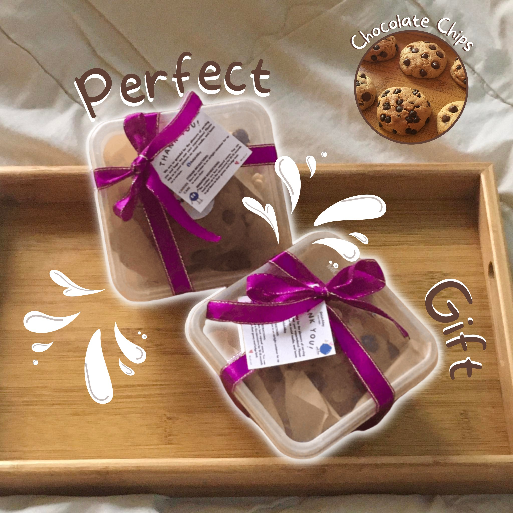

# DELISH ALLEY - A Responsive Cookie Shop Ordering Website



## 📖 About

Delish Alley is a responsive cookie shop website designed to present baked treats, cookie bundles, and customer order options in a clean and user-friendly way.

The project focuses on improving the online presence of a small food business by organizing products into easy-to-browse pages, highlighting best-selling treats, and providing a simple order flow where customers can review their selected item, quantity, fulfillment method, and estimated total before final confirmation.

Unlike a full backend-powered e-commerce platform, Delish Alley is currently built as a static front-end website using HTML, CSS, and JavaScript. It is designed to be lightweight, easy to deploy, and ready for future integration with a database, payment system, email service, or admin dashboard.

## 🎓 Story

I created Delish Alley as a front-end web design project to practice building a polished and customer-friendly website for a food business concept.

My goal was to make the website feel more professional, modern, and easier to use compared to a basic product listing page. I focused on clean navigation, attractive product cards, responsive layouts, live order summaries, and a warm cookie-shop visual style that matches the brand’s sweet and cozy identity.

Through this project, I was able to apply UI/UX design principles, responsive web development, product presentation, and simple JavaScript interaction to create a more complete browsing and ordering experience.

## 🚀 Live Demo

This project can be deployed for free using platforms such as **Vercel**, **Netlify**, or **GitHub Pages**.

> ⚠️ **Note:** Delish Alley is currently a static website.
> The order form uses browser `localStorage` for the order review page.
> Backend features such as real authentication, database storage, online payment, and email notifications can be added in future versions.

**[🔗 Visit Live Site](https://your-delish-alley-link.vercel.app)**

## ✨ Key Features

### 🌐 Customer-Facing Website

* **Responsive Landing Page:** A modern homepage that introduces Delish Alley, highlights best-selling treats, and guides users toward the menu or order form.
* **Product Menu Page:** Displays cookies, pastries, and bundles with product images, descriptions, categories, and prices.
* **Product Highlights Page:** Organizes Delish Alley treats into customer-friendly groups such as cookies, pastry, and gift bundles.
* **Category Filtering:** Allows users to filter menu items by category, making it easier to browse specific product types.
* **Interactive Order Form:** Customers can enter their details, choose a product, set quantity, select pickup or delivery, and view a live estimated total.
* **Order Review Page:** Saves the latest submitted order using `localStorage` and displays a clear summary for customer confirmation.
* **Login Preview Page:** Includes a polished login interface prepared for future customer or admin authentication.
* **Mobile-Friendly Navigation:** Includes a responsive menu toggle for smaller screens while keeping navigation simple and accessible.
* **Consistent Branding:** Uses warm colors, rounded cards, cookie-themed visuals, and a cozy bakery-inspired layout.

## 🛠 Tech Stack

**Frontend:**

* **HTML5** – For the website structure and page content.
* **CSS3** – For responsive layouts, product cards, navigation, buttons, and visual design.
* **JavaScript** – For menu filtering, live order summary, form handling, localStorage order review, mobile navigation, and login preview behavior.

**Browser Storage:**

* **localStorage** – Temporarily stores the submitted order so it can appear on the order review page.

**Tools:**

* **Git / GitHub** – Version control and repository management.
* **Vercel / Netlify / GitHub Pages** – Recommended free deployment options for the static website.

---

## 📂 Project Structure

This repository contains a static front-end website for Delish Alley.

```text
├── Index.html              # Homepage / landing page
├── menus.html              # Full menu page with category filtering
├── Product.html            # Product highlights and featured items
├── form.html               # Customer order form with live summary
├── Loginform.html          # Static login preview page
├── final-shit.html         # Order review / confirmation preview page
├── app.js                  # JavaScript interactions and localStorage logic
├── README_FIRST.txt        # Original project notes
│
├── CSS/
│   └── delishAlley.css     # Main stylesheet and responsive design
│
└── assets/                 # Product and banner images
    ├── Perfectgift.jpg
    ├── Classicchips.jpg
    ├── Bananaloaf.jpg
    ├── Bischips.jpg
    └── ...
```
